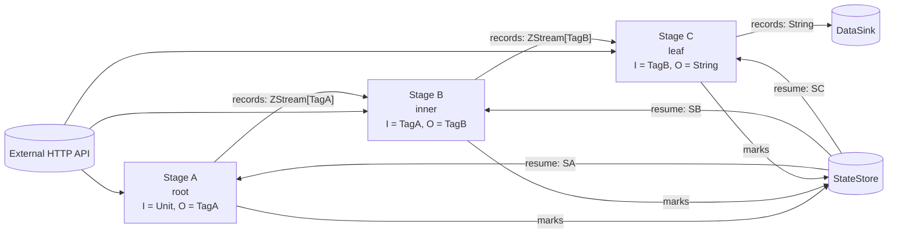
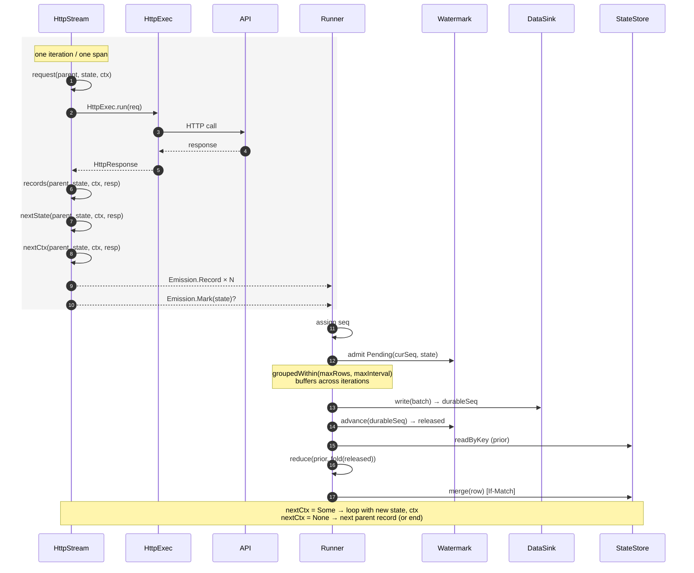

# HTTP connector model

How an `HttpStream` produces records, how state moves through the
runner, and how stages compose.

For the API reference (the four primitives, `HttpResponse`, `HttpExec`,
`HttpExloApp`), see [architecture.md](./architecture.md). This doc is
about the *shape*: what arrows go where, in what order things happen,
and where the model has and hasn't been pressure-tested yet.

## Stage graph

A connector is a chain of stages. Three positions in the graph:

- **Root** — `Stage[Unit, O, S, R]`. No parent. Pulls from an external
  API. Most `HttpStream`s.
- **Inner** — `Stage[I, O, S, R]` with `I ≠ Unit`. Consumes the
  upstream stage's record stream, emits its own.
- **Leaf** — `Stage[I, String, S, R]`. Output is `String`; records flow
  into the `DataSink`.



Every `HttpStream` calls the API — that's its job. What distinguishes
*root* from *inner* isn't whether the API is involved; it's whether a
parent stage feeds it. An inner stage typically uses each parent record
as input to its own request (e.g., parent emits pokemon URLs, child
`GET`s each URL).

Composition is plain `ZStream` piping. There's no `Source[T]` env
service or `FedBy` ZLayer indirection — each stage's `Stage.run` returns
a `ZStream[R, ExloError, Emission[O, S]]`, the runner pulls `Record`s
out and feeds them to the next stage's input, and side-effects each
stage's `Mark`s into that stage's watermark/state-commit machinery.

Only the leaf stage's records hit the DataSink. Intermediate stages'
records are in-memory hand-offs to the next stage.

## One iteration

Each invocation of the step function — `request` → `records` →
`nextState` → `nextCtx` — produces one *span* of work: one HTTP call,
its records, optionally one mark, optionally one next step. The runner
sequences records into a stream, batches them by row count or time, and
(when a flush succeeds) commits any released marks via a conditional
StateStore write.



Two observations worth flagging:

- **`state` and `ctx` ride different paths.** Only `state` reaches the
  StateStore, and only via the Watermark → DataSink ordering: the Mark
  commits *after* the Records it describes are durable.
- **A span can be records-only, mark-only, or both.** The "final
  advance" on stream end exists specifically to flush a
  Mark-without-Record case (`Pending(0, _)` — a mark emitted before any
  record).

## Where the work lives

The "body of work" for a stream is implicit, not stored:

```
state (durable)
  +
parent stream (ZStream of upstream records)   →    body of work
  +
step function (nextCtx)
```

Concretely:

- **State** is read once at run start. Inside `HttpStream.asStage`, the
  resume value is stored in an internal `Ref` that gets updated whenever
  `nextState` returns `Some`. So the `state` value passed to `request` /
  `records` / `nextCtx` evolves *within* a run as Marks fire — including
  across multiple parent records.
- **Parent stream** (when present) is consumed lazily — each parent
  record drives the inner walker until `nextCtx` returns `None`, then
  the next parent record arrives. No buffering.
- **Step function** is a linked list per parent: `(state, ctx) → next
  (state, ctx)`. One step in, one step out. No queue, no branching
  *within a stream*.

To "do something different across runs," restart with new state. To
"do something different at run-time," structure the work as multiple
stages.

### What this can't express within a single stream

Branching or fan-out inside one `HttpStream`:

- Bisecting a failing window into two narrower windows.
- Conditional sub-fetch (e.g., "if this issue has `comment_count > 50`,
  also fetch its comments inline").
- Tree traversal where each node can spawn 0..N child fetches.

For list-and-detail and tree-shape sources, the answer is "use two or
more stages, chained" — the parent stream enumerates parents, the child
stream pulls detail per parent. ZStream piping handles the wire-up; no
custom plumbing.

For bisection on transient errors, there's currently no answer; re-run
picks up at the prior commit. If a real connector forces the issue:

1. **`nextCtx: Chunk[Map[String, String]]`** — return many. Empty =
   stop. Length 1 = current behavior. >1 pushes work onto an internal
   queue. Smallest change. Bisection becomes "return both halves on
   failure."
2. **A scheduler service in the env** — user code calls
   `Scheduler.add(req)` from anywhere. Decouples discovery from the
   step function. More expressive, more machinery.

Neither is built. The brandwatch port (queries → mentions) is the next
validation; if multi-stage chaining covers the cases we hit, the
single-stream branching question stays parked.
